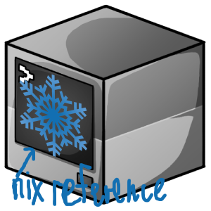

<h3 align="center"><br>serverix - <i>build your minecraft server in declarative way</i></h3>

serverix is a lua script that allows you to create your minecraft server in a declarative way, it is designed for people who like to pre-configure things and get a ready-to-use product. serverix's killer feature is NixOS-inspired build system. When rebuilding an existing server (detected via a `serverix.yml` file), serverix automatically generates a new, uniquely versioned build. This allows you to easily roll back to any previous state if something goes wrong

## Usage
Usage of `serverix` is pretty simple and straightforward:
1. create a lua file that will be a configuration of your server
2. require serverix in it
```lua
local serverix = require("serverix") 
```
3. write configuration for your server``
```lua
local my_server = {
    server = {
        version = "1.20.1",
        core = "https://meta.fabricmc.net/v2/versions/loader/1.20.1/0.16.14/1.0.3/server/jar", --link to core's jar
        folder = "/home/user/server/", --folder where server will be builded
        bukkitPlugins = nil, --plugins is nil, because we're on fabric in this example, if our server's core was e.g. Paper, our mods would be nil
        mods = mods, --table with your mods
        runscript = {
            content = "java -Xmx4G -jar server.jar nogui", --content of run.sh file
            autoeula = true --auto accept of EULA
        }, 
        properties = { --see https://minecraft.wiki/w/Server.properties
            ["enable-jmx-monitoring"] = false,
            ["rcon.port"] = 25575,
            ["level-seed"] = "",
            gamemode = "survival",
            ["enable-command-block"] = false,
            ["enable-query"] = false,
            ["generator-settings"] = "{}",
            ["enforce-secure-profile"] = true,
            ["level-name"] = "world",
            motd = "KSMP",
            ["query.port"] = 25565,
            pvp = true,
            ["generate-structures"] = true,
            ["max-chained-neighbor-updates"] = 1000000,
            difficulty = "normal",
            ["network-compression-threshold"] = 256,
            ["max-tick-time"] = 60000,
            ["require-resource-pack"] = false,
            ["use-native-transport"] = true,
            ["max-players"] = 6,
            ["online-mode"] = false,
            ["enable-status"] = true,
            ["allow-flight"] = false,
            ["initial-disabled-packs"] = "",
            ["broadcast-rcon-to-ops"] = true,
            ["view-distance"] = 10,
            ["server-ip"] = "",
            ["resource-pack-prompt"] = "",
            ["allow-nether"] = true,
            ["server-port"] = 25565,
            ["enable-rcon"] = false,
            ["sync-chunk-writes"] = true,
            ["op-permission-level"] = 4,
            ["prevent-proxy-connections"] = false,
            ["hide-online-players"] = false,
            ["resource-pack"] = "",
            ["entity-broadcast-range-percentage"] = 100,
            ["simulation-distance"] = 4,
            ["rcon.password"] = "",
            ["player-idle-timeout"] = 0,
            ["force-gamemode"] = false,
            ["rate-limit"] = 0,
            hardcore = false,
            ["white-list"] = false,
            ["broadcast-console-to-ops"] = true,
            ["spawn-npcs"] = true,
            ["spawn-animals"] = true,
            ["log-ips"] = true,
            ["function-permission-level"] = 2,
            ["initial-enabled-packs"] = "vanilla",
            ["level-type"] = "minecraft\\:normal",
            ["text-filtering-config"] = "",
            ["spawn-monsters"] = true,
            ["enforce-whitelist"] = false,
            ["spawn-protection"] = 16,
            ["resource-pack-sha1"] = "",
            ["max-world-size"] = 29999984
        }
    }
}
```

4. use `serverix.InitServer` method to build your server
```lua
serverix.InitServer(  --initiate your server
    my_server
)
```
5. run your lua file and serverix will build server for your
## Installation
### Prerequisites
- `lua 5.1`
- `luasec`
- `dkjson`
- `sha1`
- `lfs`
- `lyaml`

> [!TIP]
> It's recommended to install `luasec`, `sha1`, `lfs`, `lyaml` and `dkjson` using `luarocks`, but if you still install it **correctly**, it **should** work fine

```bash
git clone https://github.com/dtsev/serverix.git #clone this repo
cd serverix #cd into it
```
and repeat [usage](#usage) steps

## Credits
- <a href="https://www.freeiconspng.com/img/40686">Minecraft Server Icon Download Vectors Free</a>
- <a href="https://www.freeiconspng.com/img/26300">Snowflake PNG image</a>
